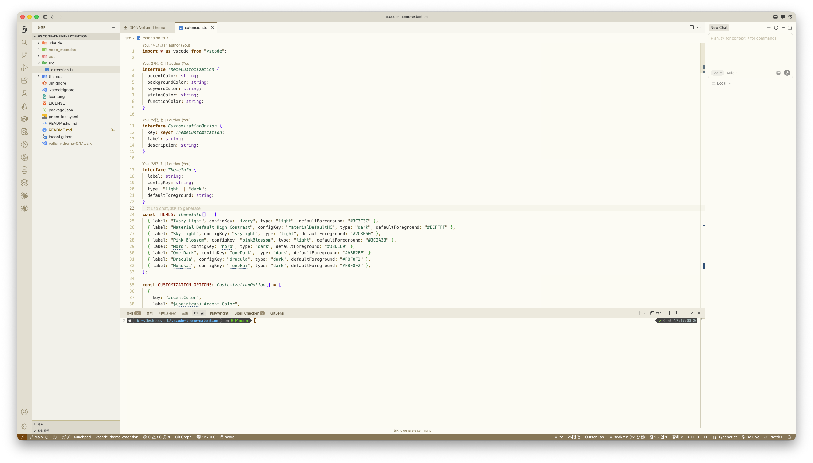
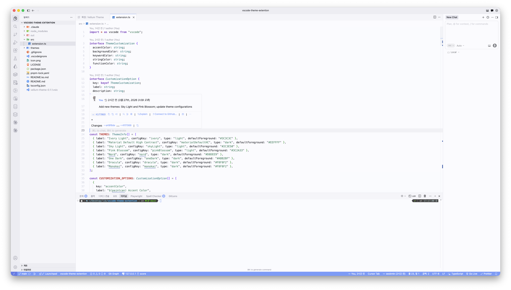
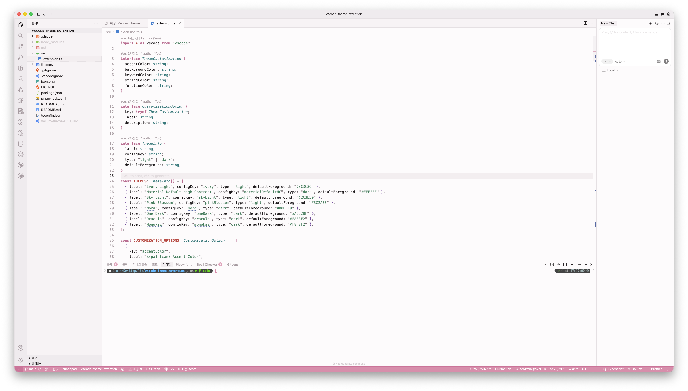
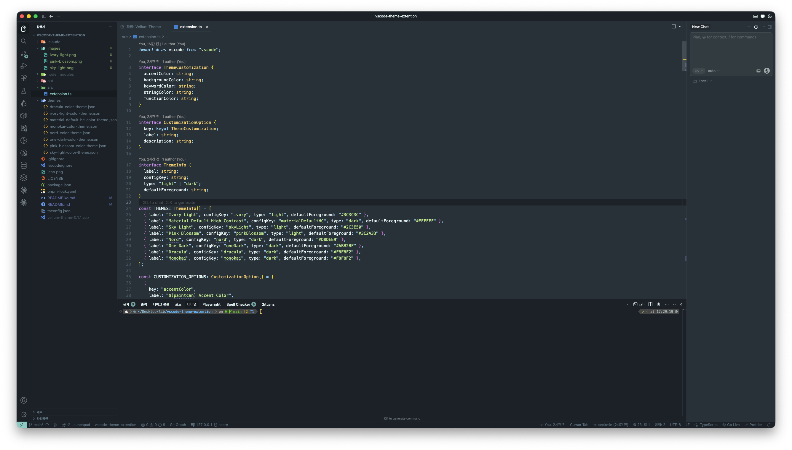
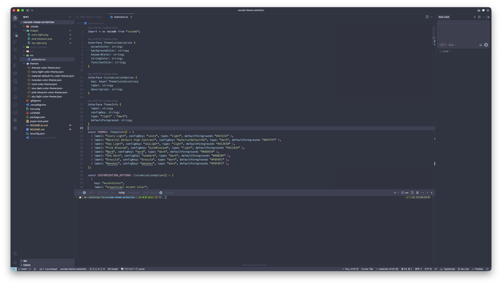
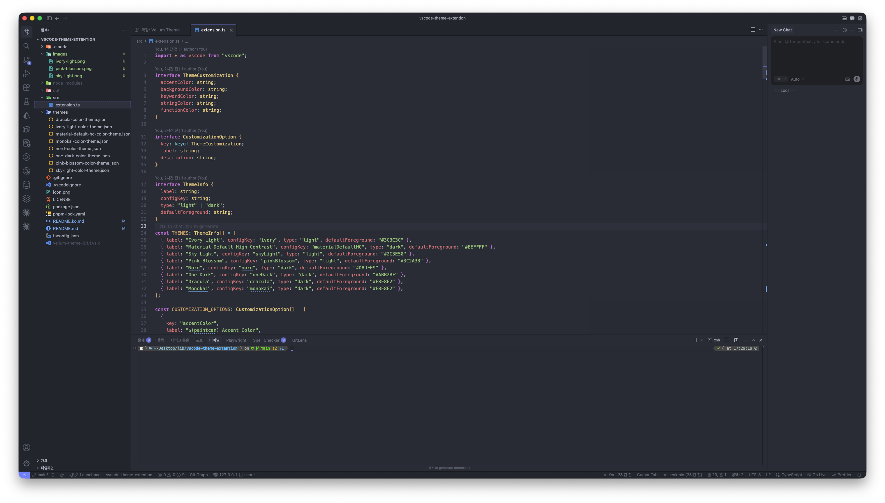
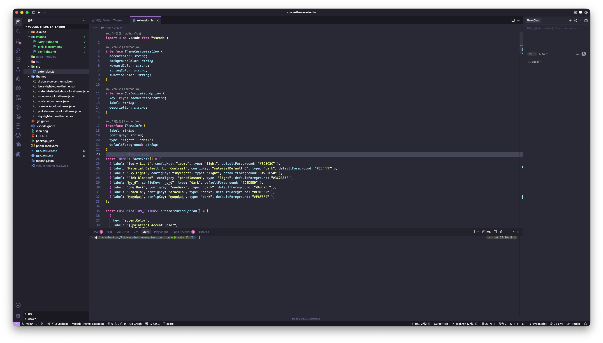
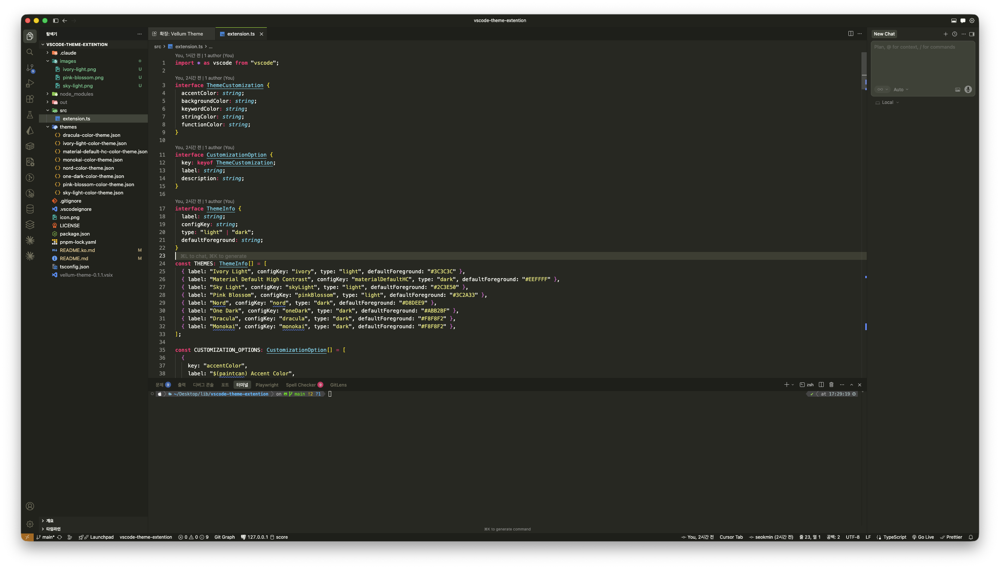

# Vellum Theme

[English](README.md)

따뜻한 양피지 느낌의 라이트 테마부터 깊은 대비의 다크 테마까지, 실시간 색상 커스터마이징을 지원하는 8가지 VS Code 테마 컬렉션입니다.

---

## 테마 목록

### 라이트

#### Ivory Light
따뜻한 아이보리 양피지 톤, 눈이 편안한 테마.


#### Sky Light
깔끔한 화이트 베이스에 시원한 스카이블루 포인트.


#### Pink Blossom
부드러운 로즈 포인트와 따뜻한 배경.


### 다크

#### Material Default High Contrast
머테리얼 디자인, 고대비 블랙.


#### Nord
북극풍 블루 톤 팔레트.


#### One Dark
Atom 에디터 스타일의 균형 잡힌 다크.


#### Dracula
퍼플 포인트의 클래식 다크.


#### Monokai
어두운 배경 위의 생생한 구문 강조.


---

## 설치

### Marketplace에서 설치

1. VS Code 확장 패널 열기 (`Cmd+Shift+X` Mac / `Ctrl+Shift+X` Windows/Linux)
2. **Vellum Theme** 검색
3. **Install** 클릭

또는 [Visual Studio Marketplace](https://marketplace.visualstudio.com/items?itemName=msm0748.vellum-theme)에서 직접 설치할 수 있습니다.

### VSIX 파일로 설치

```bash
code --install-extension vellum-theme-0.1.1.vsix
```

### 소스에서 빌드

```bash
pnpm install
pnpm run compile
pnpm run package
code --install-extension vellum-theme-*.vsix
```

---

## 테마 적용

`Cmd+K Cmd+T` (Mac) / `Ctrl+K Ctrl+T` (Windows/Linux) → 목록에서 선택:

- Ivory Light
- Sky Light
- Pink Blossom
- Material Default High Contrast
- Nord
- One Dark
- Dracula
- Monokai

---

## 커스터마이징

### 명령 팔레트

1. `Cmd+Shift+P` (Mac) / `Ctrl+Shift+P` (Windows/Linux) → **Vellum Theme: Customize Colors**
2. 변경할 항목 선택:
   - **Accent Color** — 상태바, 배지, 버튼 색상
   - **Background Color** — 에디터 배경색
   - **Keyword Color** — `if`, `const`, `return` 등 키워드 색상
   - **String Color** — 문자열 리터럴 색상
   - **Function Color** — 함수/메서드 이름 색상
3. Hex 색상 코드 입력 (예: `#FF5370`)

### settings.json

```jsonc
{
  // 예시: Sky Light 커스터마이징
  "vellumTheme.skyLight.accentColor": "#64A3F8",
  "vellumTheme.skyLight.backgroundColor": "#F5F9FD",
  "vellumTheme.skyLight.keywordColor": "#1565C0",
  "vellumTheme.skyLight.stringColor": "#2E7D32",
  "vellumTheme.skyLight.functionColor": "#6A1B9A",

  // 예시: Pink Blossom 커스터마이징
  "vellumTheme.pinkBlossom.accentColor": "#E08BAB",
  "vellumTheme.pinkBlossom.backgroundColor": "#FDF5F7",
  "vellumTheme.pinkBlossom.keywordColor": "#AD1457",
  "vellumTheme.pinkBlossom.stringColor": "#2E7D32",
  "vellumTheme.pinkBlossom.functionColor": "#4527A0"
}
```

### 세밀한 오버라이드

```jsonc
{
  "workbench.colorCustomizations": {
    "[Sky Light]": {
      "editor.background": "#F0F5FF",
      "statusBar.background": "#5B99E6"
    }
  },
  "editor.tokenColorCustomizations": {
    "[Pink Blossom]": {
      "textMateRules": [
        {
          "scope": ["variable.parameter"],
          "settings": { "foreground": "#9C3B6B", "fontStyle": "italic" }
        }
      ]
    }
  }
}
```

### 초기화

`Cmd+Shift+P` / `Ctrl+Shift+P` → **Vellum Theme: Reset to Defaults**

---

## 설정 레퍼런스

### Ivory Light

| 키 | 기본값 | 설명 |
|----|--------|------|
| `vellumTheme.ivory.accentColor` | `#8B7355` | 포인트 색상 |
| `vellumTheme.ivory.backgroundColor` | `#FDFAF3` | 배경색 |
| `vellumTheme.ivory.keywordColor` | `#7C3F00` | 키워드 색상 |
| `vellumTheme.ivory.stringColor` | `#2D6A4F` | 문자열 색상 |
| `vellumTheme.ivory.functionColor` | `#1A5276` | 함수 색상 |

### Sky Light

| 키 | 기본값 | 설명 |
|----|--------|------|
| `vellumTheme.skyLight.accentColor` | `#7BB5E8` | 포인트 색상 |
| `vellumTheme.skyLight.backgroundColor` | `#F5F9FD` | 배경색 |
| `vellumTheme.skyLight.keywordColor` | `#1565C0` | 키워드 색상 |
| `vellumTheme.skyLight.stringColor` | `#2E7D32` | 문자열 색상 |
| `vellumTheme.skyLight.functionColor` | `#6A1B9A` | 함수 색상 |

### Pink Blossom

| 키 | 기본값 | 설명 |
|----|--------|------|
| `vellumTheme.pinkBlossom.accentColor` | `#E08BAB` | 포인트 색상 |
| `vellumTheme.pinkBlossom.backgroundColor` | `#FDF5F7` | 배경색 |
| `vellumTheme.pinkBlossom.keywordColor` | `#AD1457` | 키워드 색상 |
| `vellumTheme.pinkBlossom.stringColor` | `#2E7D32` | 문자열 색상 |
| `vellumTheme.pinkBlossom.functionColor` | `#4527A0` | 함수 색상 |

### Material Default High Contrast

| 키 | 기본값 | 설명 |
|----|--------|------|
| `vellumTheme.materialDefaultHC.accentColor` | `#82AAFF` | 포인트 색상 |
| `vellumTheme.materialDefaultHC.backgroundColor` | `#000000` | 배경색 |
| `vellumTheme.materialDefaultHC.keywordColor` | `#FF5370` | 키워드 색상 |
| `vellumTheme.materialDefaultHC.stringColor` | `#C3E88D` | 문자열 색상 |
| `vellumTheme.materialDefaultHC.functionColor` | `#82AAFF` | 함수 색상 |

### Nord

| 키 | 기본값 | 설명 |
|----|--------|------|
| `vellumTheme.nord.accentColor` | `#88C0D0` | 포인트 색상 |
| `vellumTheme.nord.backgroundColor` | `#2E3440` | 배경색 |
| `vellumTheme.nord.keywordColor` | `#81A1C1` | 키워드 색상 |
| `vellumTheme.nord.stringColor` | `#A3BE8C` | 문자열 색상 |
| `vellumTheme.nord.functionColor` | `#88C0D0` | 함수 색상 |

### One Dark

| 키 | 기본값 | 설명 |
|----|--------|------|
| `vellumTheme.oneDark.accentColor` | `#61AFEF` | 포인트 색상 |
| `vellumTheme.oneDark.backgroundColor` | `#282C34` | 배경색 |
| `vellumTheme.oneDark.keywordColor` | `#C678DD` | 키워드 색상 |
| `vellumTheme.oneDark.stringColor` | `#98C379` | 문자열 색상 |
| `vellumTheme.oneDark.functionColor` | `#61AFEF` | 함수 색상 |

### Dracula

| 키 | 기본값 | 설명 |
|----|--------|------|
| `vellumTheme.dracula.accentColor` | `#BD93F9` | 포인트 색상 |
| `vellumTheme.dracula.backgroundColor` | `#282A36` | 배경색 |
| `vellumTheme.dracula.keywordColor` | `#FF79C6` | 키워드 색상 |
| `vellumTheme.dracula.stringColor` | `#F1FA8C` | 문자열 색상 |
| `vellumTheme.dracula.functionColor` | `#50FA7B` | 함수 색상 |

### Monokai

| 키 | 기본값 | 설명 |
|----|--------|------|
| `vellumTheme.monokai.accentColor` | `#F92672` | 포인트 색상 |
| `vellumTheme.monokai.backgroundColor` | `#272822` | 배경색 |
| `vellumTheme.monokai.keywordColor` | `#F92672` | 키워드 색상 |
| `vellumTheme.monokai.stringColor` | `#E6DB74` | 문자열 색상 |
| `vellumTheme.monokai.functionColor` | `#A6E22E` | 함수 색상 |

---

## 개발

```bash
pnpm run compile   # TypeScript 컴파일
pnpm run watch     # 감시 모드
pnpm run lint      # ESLint 검사
pnpm run package   # .vsix 빌드
```

---

## 지원 언어

JavaScript, TypeScript, Python, Rust, Go, Java, C/C++, HTML, CSS, JSON, Markdown, YAML, Shell 및 VS Code TextMate 문법을 사용하는 모든 언어를 지원합니다.

---

## 라이선스

[MIT](LICENSE)

"Material Default High Contrast" 테마는 Mattia Astorino의 [Material Theme](https://github.com/material-theme/vsc-material-theme)을 기반으로 하며, [Apache 2.0](http://www.apache.org/licenses/LICENSE-2.0) 라이선스로 제공됩니다.
